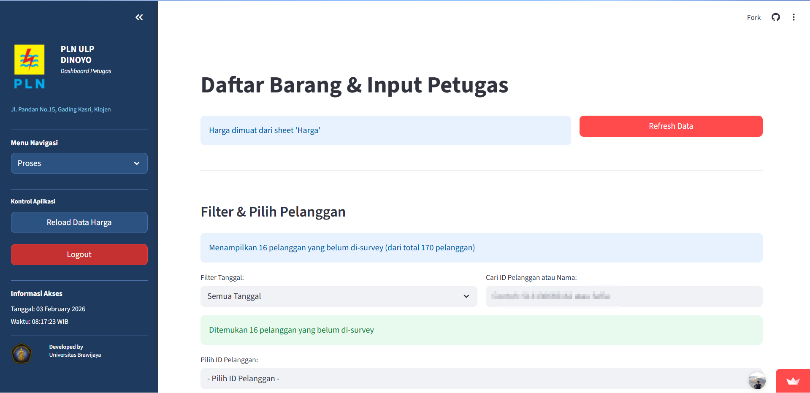
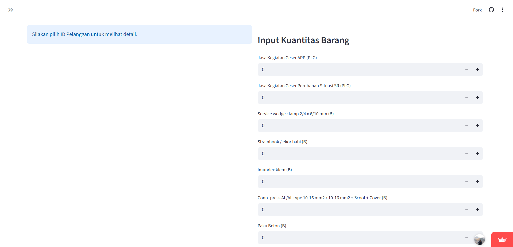
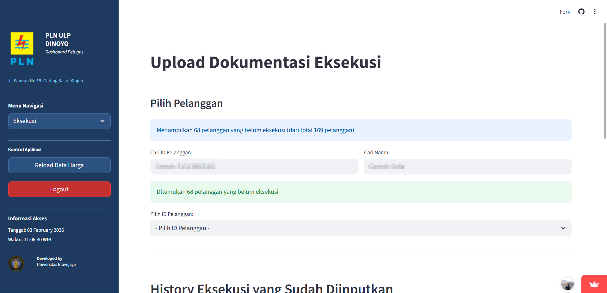

# Aplikasi Permohonan Geser Meter - PLN ULP Dinoyo

Aplikasi berbasis **Streamlit** untuk mengefisiensikan alur kerja petugas dalam menangani permohonan geser meter dari pelanggan PLN ULP Dinoyo.

🔗 **Live Demo:** [permohonan-geser-meter.streamlit.app](https://permohonan-geser-meter.streamlit.app/)

---

## 📊 Alur Kerja Sistem

### 1️⃣ Pengisian Permohonan oleh Pelanggan
Pelanggan mengisi data yang dibutuhkan untuk permohonan geser meter melalui **Google Form** yang disediakan. Data otomatis masuk ke Google Spreadsheet (Form Response).

### 2️⃣ Survey Lapangan oleh Petugas
Petugas lapangan melakukan survey ke lokasi ID Pelanggan yang bersangkutan. Setelah survey selesai, petugas mengisi:
- **Barang-barang yang dibutuhkan** (kuantitas material)
- **Foto hasil survey**



### 3️⃣ Simpan Data Survey
Setelah semua data terisi, petugas menekan tombol **Simpan**. Sistem otomatis menyimpan data ke bagian *"Data Survey yang Sudah Tersimpan"*.



### 4️⃣ Export Rekap ke Sheets
Petugas memilih ID Pelanggan yang ingin di-export. Sistem akan menampilkan preview 2 rekapan:
- **Rekap untuk Pelanggan** - detail material dan biaya
- **Rekap Harga untuk Vendor** - kalkulasi harga vendor

Tabel di-copy dari template yang sudah memiliki formula perhitungan pada kolom Material, Jasa, dan Total.

### 5️⃣ Update Tanggal Survey Otomatis
Setelah export, sistem otomatis mengisi **Kolom Tanggal Survey** pada Google Spreadsheet dengan format `DD/MM/YYYY HH:MM:SS`.

### 6️⃣ Proses Administrasi
Petugas administrasi memproses data dan menekan tombol **Sync To Rekap_Material** untuk sinkronisasi data.

### 7️⃣ Eksekusi Lapangan
Setelah diproses, petugas lapangan melakukan eksekusi ke alamat pelanggan. Kemudian mengisi **Dokumentasi Eksekusi** di menu Eksekusi:
- Pilih ID Pelanggan yang sudah dieksekusi
- Upload foto dokumentasi bukti pengerjaan



### 8️⃣ Update Tanggal Eksekusi Otomatis
Sistem otomatis mengisi **Tanggal Eksekusi** pada Google Spreadsheet dengan format `DD/MM/YYYY`.

---

## 🛠️ Tech Stack

| Teknologi | Kegunaan |
|-----------|----------|
| **Streamlit** | Framework web aplikasi |
| **Google Sheets API** | Database & penyimpanan data |
| **Google Drive API** | Penyimpanan foto |
| **Cloudflare R2** | Object storage untuk upload foto |
| **Python** | Backend logic |

---

## 🚀 Menjalankan Aplikasi

```bash
# Install dependencies
pip install -r requirements.txt

# Jalankan aplikasi
streamlit run app.py
```

---

## 👨‍💻 Pengembang

**Universitas Brawijaya** - PLN ULP Dinoyo

## 📄 Lisensi

Proprietary - PLN Indonesia
